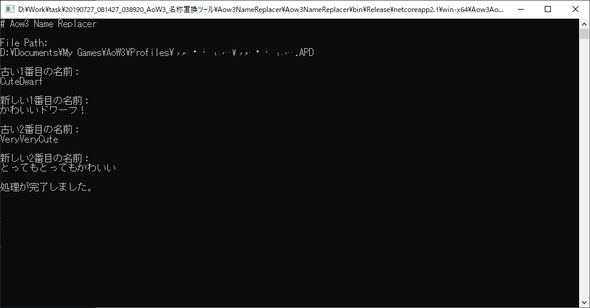

AOW3 Name Replacer
===

## 手順
1. ゲームを起動して、カスタム指導者を作ります。

2. ゲームを終了します。

3. Aow3-Name-Replace.exeを実行します。

4. 任意のProfileファイルを対象に、[1]で作成したカスタム指導者の名前、新しい名前（※変更前の名前と同じ文字数である必要あり）を指定します。  
※Profileファイルは「C:\Users\(your name)\Documents\My Games\AoW3\Profiles」に保存されています。

5. ゲームを起動して、名前が置き換わったことを確認してください。

!!! 問題が起きた場合、File Pathで指定したProfileファイルと同じ場所に「{ ユーザー }.APD.backup」という名前で、元ファイルがバックアップされています。このツールで変更されたAPDファイルを削除し、バックアップファイルを元ファイルの内容にリネームしてください。

## 留意事項
- 置換対象の名前と新しい名前は同じ文字数にする必要があります。  
    
    例：  

    |既存の名前|新しい名前|結果|
    |:---|:---|:---|
    |abcde|あいうえお|あいうえお|
    |abcde|あいう|あいうXXX|
    |abc|あいうえお|あいうえおXXX|

    __※XXXは文字化けした表現を指します。__
    
- 置換の処理は2番目の名前、1番目の名前の順番で行われます。  
  その為、指定した内容によっては次のような意図しない発生が起きます。

    例：  
    1番目の名前：カレーライス ⇒ ハヤシライス  
    2番目の名前：カレー ⇒ うどん  
    
    × このようにはならない：

    |1番目の名前|2番目の名前| |1番目の名前|2番目の名前|
    |:---|:---|:---:|:---|:---|
    |カレーライス|カレー|⇒|ハヤシライス|うどん|

    ○ 実際にはこのようになる：
    
    |1番目の名前|2番目の名前| |1番目の名前|2番目の名前|
    |:---|:---|:---:|:---|:---|
    |カレーライス|カレー|⇒|うどんライス|うどん|

- このツールは単純なバイナリ置換を行います。その為、最初に置き換える名前次第ではファイルが破損することがあります。例えば、指導者の髪/ポーズの設定に関する内容の全体、あるいは一部に該当する名前は、この問題を引き起こします。なので置換対象の名前は「xxxx」とか「abcdef」のような、意味のなさそうな内容にすることを推奨します。