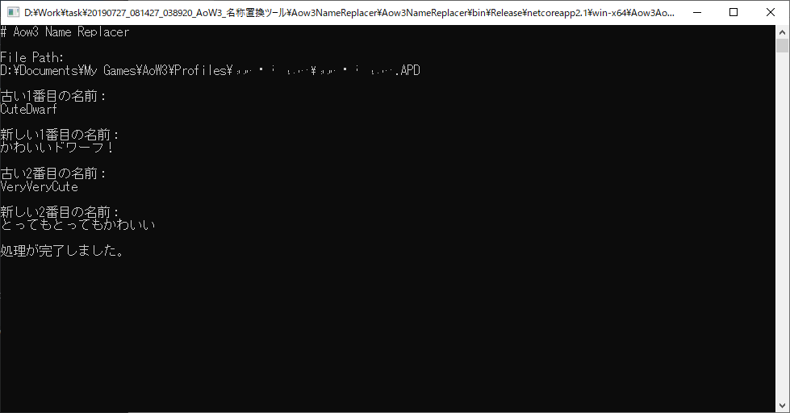

Age of Wonders III バイナリ置換ツール
===

## 概要
Age of Wonders III は有志の翻訳で日本語化して遊ぶことができる。  
しかしながら、日本語の入力ができないので自分で作ったキャラクターに  
日本語の名前をつけることができない。どうしても日本語の名前を付けたい場合は  
自分の作ったキャラクターが保存されているバイナリファイルの内容を書き換える  
以外に方法がない。この方法は、日本語Wikiの[カスタム指導者の日本語化](https://aow3.swiki.jp/index.php?%E8%B3%BC%E5%85%A5%E5%BE%8CFAQ)で解説さ  
れているが、やや手順が面倒だったりする。このツールを使えば、少しだけ楽にできる。

## 手順
1. カスタム指導者を作る。

2. 任意のProfileファイルを、対象に上記で設定した名前と新しい名前を入力する。  
   ※Profileファイルは「...\My Games\AoW3\Profiles\ { ユーザー } / { ユーザー }.APD」にある？

3. 名前が置き換わったことを確認する。

4. 問題が起きた場合、File Pathで指定したProfileファイルと同じ場所に  
   「{ ユーザー }.APD.backup」という名前でバックアップがあるので  
   それを「{ ユーザー }.APD」にリネームすれば、処理の前に戻る。

## 留意事項
- 置換対象の名前と新しい名前は同じ文字数にする必要がある。  
    
    例：  

    |既存の名前|新しい名前|結果|
    |:---|:---|:---|
    |abcde|あいうえお|あいうえお|
    |abcde|あいう|あいうXXX|
    |abc|あいうえお|あいうえおXXX|

    __※XXXは文字化けした表現を指す。__
    
- 置換の処理は2番目の名前、1番目の名前の順番で行われる。  
  なので、指定した内容によっては次みたいな現象が起きる。

    例：  
    1番目の名前：カレーライス ⇒ ハヤシライス  
    2番目の名前：カレー ⇒ うどん  
    
    × このようにはならない：

    |1番目の名前|2番目の名前| |1番目の名前|2番目の名前|
    |:---|:---|:---:|:---|:---|
    |カレーライス|カレー|⇒|ハヤシライス|うどん|

    ○ 実際にはこのようになる：
    
    |1番目の名前|2番目の名前| |1番目の名前|2番目の名前|
    |:---|:---|:---:|:---|:---|
    |カレーライス|カレー|⇒|うどんライス|うどん|

## 参考
- [Steam - Age of Wonders III](https://store.steampowered.com/app/226840/Age_of_Wonders_III/)
- [カスタム指導者の日本語化](https://aow3.swiki.jp/index.php?%E8%B3%BC%E5%85%A5%E5%BE%8CFAQ)